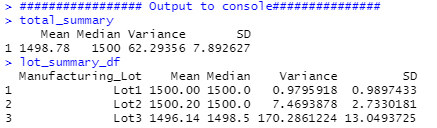
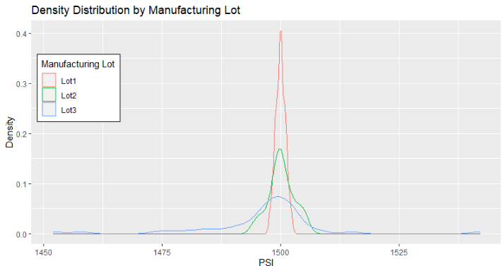
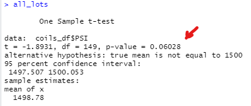
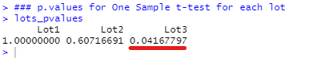

# MechaCar_Statistical_Analysis

## Overview

This project is the weekly challenge for week 15th of the Data Science Bootcamp. It allows us to put into practice and showcase the skills learned in Module 10 of the bootcamp.

### Purpose

Use R and statistical analysis to review the production data and provide insights for the manufacturing team at AutoRUs.

## Results

The following files are part of the challenge.

- [MechaCarChallenge.R](MechaCarChallenge.R) - R Script with linear regression analysis.
- [/resources folder](/resources) - holds data available for analysis

### Deliverable 1. Linear Regression to Predict MPG

Performed a linear regression using the `MechaCar_mpg.csv`. Details of the R script can be seen here: [MechaCarChallenge.R](MechaCarChallenge.R). The expression  used is:

```R
lm( mpg ~ vehicle_length + vehicle_weight + spoiler_angle + ground_clearance + AWD, mechacar_df)
```

The summary of the model results can be seen in the snapshot below.


#### Significant Variables

Using a significance level (alpha) of 0.05, we can see the following variables have a significant impact on the dependent variable `mpg`.  That is, their p-value indicate they provide a non-random amount of variance to the `mpg` values.

|Variable | p-value|
|:---|:---:|
|`vehicle_length`     | 2.60e-12  |
|`ground_clearance`   | 5.21e-08  |

#### Slope of linear model

The slope of the linear model is not zero as there are 2 independent variables (see above)significantly related to the outcome variable (`mpg`)

#### Effectiveness of the model

The linear regression produces an R-squared value of **0.7149**.  This indicates that the model is effective in predicting the `mpg` of the MechaCar prototypes.

### Deliverable 2: Summary Statistics on Suspension Coils

Performed summary statistics on the PSI data in the file `Suspension_Coil.csv`.



The design specifications of the coils dictate that the variance must not exceed 100 PSIs.

The summary statistics for the entire dataset, `total_summary` indicate a median of 1498.78 and a variance of 62.293.

However, further analysis of the data by grouping by `Manufacturing_lot` points to issues on *Lot3*.  The mean diverges to 1496.14 and the variance increases over the specification to 170.286.

Lots 1 and 2 show a compliance with specification with means equal to 1500 and 1500.2 and variances of 0.98 and 7.47.

A plot of the density distributions by lot helps visualise the issue with the coils from Lot3.



### Deliverable 3: T-test on Suspension Coils

A One Sample t-test of all the data available compared to the specified population mean of 1500psi shows that the p-value is 0.06028. 



This is higher than our confidence level (alpha) value of 0.05. However running t-tests for individual Lots shows that Lot3 falls under the confidence level.

Running a One Sample t-test on Lot3 data produces a p-value of 0.04168.



It's important to run tests on different categorical groups of the data to be able to spot problems or biases due to an specific value.

Note: I made use of a local function `lot_Pval` to calculate the p-value of the t.test for a given lot, then pulled all the unique `Manufacturing_Lot` values and looped through them, while storing the p-values into a named vector.

```r
## helper function returns p.value of t.test for Manufacturing_Lot==lot
lot_Pval = function(lot){
  return (t.test(PSI~1, data= coils_df, subset=(Manufacturing_Lot == lot), mu=1500)$p.value)
}

## generate a t.test for each existing Manufacturing_Lot
lots <- unique(coils_df$Manufacturing_Lot)
lots_pvalues <- vector()
for (lot in lots){
  lots_pvalues <- c(lots_pvalues,lot_Pval(lot))
}
## set names
names(lots_pvalues) <- lots
```

### Deliverable 4: Study Design: MechaCar vs Competition

I would proposed a study to determine whether the resale value of the MechaCar's is statistically higher than those of competitors in the same vehicle class.

#### Metric to Test

The variable of interest would be the drop on value of the vehicle (`delta_price`), this is the difference between the MSRP of the new vehicle minus the advertised resale price.

Visiting car resale sites, we need to gather at least the following information to construct our sample:

- vehicle_model
- vehicle_year
- vehicle_class
- MSRP (original price)
- resale_price
- mileage

We then need to calculate our focus (dependent):

 `delta_price = MSRP - resale_price`.

There is a relevant independent variable that from experience is relevant to resale price and represents a proxy for vehicle condition. This variable is the mileage per year of the vehicle. The variable can be estimated by the expression:

`miles_per_year = mileage / max(1,(current_year - vehicle_year))`

This variable should be bucketed into 3 groups so as maintain the variable as a categorical variable, let call it `mileage_group`. 

The boundaries of these groups (bins) could follow the general practice of low: 0-10,000 miles/year, medium: 10,000-20,000 miles/year and high: >20,000 miles/year.

#### Hypotheses

If the MechaCar has a better resale value than its competitors, then advertised used MechaCars will have a lower `delta_price` than competitors in the same vehicle class and within mileage group.

#### Null Hypotheses 

If the MechaCar doesn't have a better resale than its competitors, then the `delta_price` would not be lower with statistical significance for MechaCars when compared with competitors within the same vehicle class and mileage group.

#### Alternate Hypotheses 

If the MechaCar has a better resale value than its competitors, then the `delta_price` will be lower with statistical significant for MechaCars when compared with competitors within the same vehicle class and mileage group.

#### Statistical Test

I would use an ANOVA test. The ANOVA test allows us to have independent categorical variables (`vehicle_model`) and a continuous dependent variable `delta_price`.

The data should be filtered by `vehicle_class` and `mileage_group` to ensure we are only comparing vehicles in the same class and similar conditions.

In R, the script would have the form:

```R
aov_result <- summary(aov(delta_price ~ vehicle_model, data = input_data))
```

The significance level (alpha) recommended is 0.05.

The result from the ANOVA test would indicate whether the p-value is less than 0.05. If this is the case we can reject the null hypotheses and continue to assume our initial hypotheses.

A different type of statistical analysis would be needed in the case that the p-value is higher than alpha (0.05).
